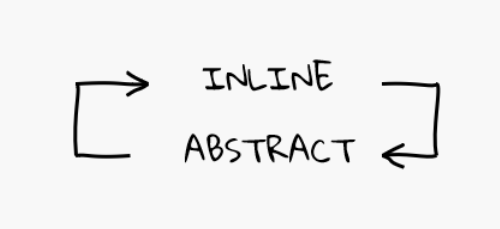

import { Global, css, jsx } from "@emotion/core";
import { Head, Notes } from "mdx-deck";

export { theme } from "./theme";

<Head>
  <title>Matryoshka Code</title>
</Head>

# Matryoshka Code

---

# What's Matryoshka Code

---

# What's Matryoshka Code

## a code smell (contrived complexity)

---

import { Split } from "mdx-deck/layouts";

# Example Time

<Split>
  
  <a href="https://codesandbox.io/s/badmatryoshkacodedontjudgemeitsforeducationpurposesonly-ct73c">codesandbox</a>
  
  

</Split>

---

# What to do?

---

# Links

- John Carmack on inlined code
  http://number-none.com/blow/john_carmack_on_inlined_code.html
- ch-athens on Matryoshka Code
  http://betabug.ch/blogs/ch-athens/1352
- Kent C. Dodds on avoiding hasty abstractions
  https://kentcdodds.com/blog/aha-programming

---

<!-- tldr -->

> duplication is far cheaper than the wrong abstraction

[@sandimetz](https://twitter.com/sandimetz)

---

<!-- thanks -->

import GithubCorner from "react-github-corner";

<GithubCorner href="https://github.com/hasparus/matryoshka-code" />
